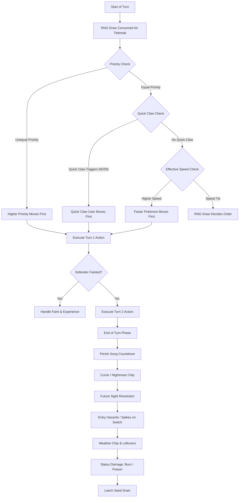

# Deep Technical Audit & Improvement Roadmap — Game Mechanics, Battle Engine, Voyage, Capture, and Meta Systems

**Author**: Explorer 2 (Milestone 1 — Codebase Audit & Improvement Roadmap)  
**Date**: August 2026  
**Scope**: `js/poke/combat.js`, `moteur.js`, `types.js`, `regles.js`, `capture.js`, `voyage.js`, `monde.js`, `actes.js`, `carte-actes.js`, `butin.js`, `serments.js`, `sceaux.js`, `acquis.js`, `chasses.js`, `regle-du-jour.js`, `fusion.js`, `progression.js`, and `js/poke/gen2/*`.

---

## 1. Executive Summary

Road to Legends (Mode Pokémon) implements a complete, deterministic, seed-driven Roguelite Pokémon simulation engine spanning Generation 1 (Kanto, 151 Pokémon, Red/Blue) and Generation 2 (Johto, 251 Pokémon, Crystal).

The codebase exhibits exceptional architectural rigor:
1. **Strict Core/UI Separation (`NOYAU` vs `ECRANS`)**: Simulation logic is purely functional, zero DOM access, communicating via structured event payloads `{t: "...", ...}`.
2. **Determinism & Server Replay Contract**: All randomness is channeled strictly through `PokeHasard` (`mulberry32`). Any added or removed RNG draw invalidates server score verification for the Daily Challenge.
3. **Multi-Generational Rule Registry (`PokeRegles`)**: Gen 2 rules, stat splits, move mappings, hold items, and encounter pools are cleanly injected via interface accessors without polluting the Gen 1 engine.

This audit details the mathematical formulas, status handling, world progression graphs, capture mechanics, roguelite compounding, and presents a prioritized improvement roadmap.

---

## 2. Combat & Stat Engine Audit

### 2.1 Damage Calculation Formula (`combat.js`, lines 580–840)

The base damage calculation adheres strictly to the canonical Pokémon formula with deliberate, documented deviations:

$$\text{Damage} = \left\lfloor \left( \left\lfloor \frac{2 \times L}{5} + 2 \right\rfloor \times \text{Power} \times \frac{A}{D} \times \frac{1}{50} + 2 \right) \times \text{Modificateurs} \right\rfloor$$

#### Key Components:
- **Stat Retrieval**:
  - Physical: Uses `atk` vs `def`. Burn status cuts physical Attack by half (`Math.floor(atk / 2)`).
  - Special: Gen 1 uses unified `spe`; Gen 2 uses `sat` (Special Attack) vs `sdf` (Special Defense) retrieved via `PokeRegles.speAtk()` and `speDef()`.
  - Stat Stages: Multiplied by `facteurPalier(stage)` mapping $[-6, +6]$ to $[2/8, \dots, 8/2]$.
- **Badge Boosts**:
  - In Kanto: Boulder (+12.5% Atk), Thunder (+12.5% Speed), Soul (+12.5% Def), Volcano (+12.5% Special).
  - In Johto: Zephyr (+12.5% Atk), Plain (+12.5% Speed), Mineral (+12.5% Def), Glacier (+12.5% Special).
- **Critical Hits**:
  - Gen 1 Base Speed threshold: $\frac{\text{BaseSpeed}}{512}$ for normal moves, $\frac{\text{BaseSpeed}}{64}$ for high-crit moves (`SLASH`, `CRABHAMMER`, `RAZOR_LEAF`, `KARATE_CHOP`).
  - *Focus Energy Bug*: Accurately mirrors the 1996 ROM bug dividing crit rate by 4 (`Math.floor(base / 4)`) instead of multiplying.
  - Gen 2 Scope Lens (`HELD_CRITICAL_UP`): Multiplies crit chance by 2.
  - Critical hits bypass defensive screens (Reflect / Light Screen) and negative attacker stat stages / positive defender stat stages.
- **Screens & Explosions**:
  - `REFLECT`: Doubles effective physical Defense when not critting.
  - `LIGHT_SCREEN`: Doubles effective special Defense when not critting.
  - `EXPLODE_EFFECT`: Halves defender's Defense during calculation.
- **Type Effectiveness & STAB**:
  - STAB: $\times 1.5$ if move type matches attacker's primary or secondary type.
  - Type Matchups: Read from `POKE_TYPE_TABLE` (Gen 1) or `POKE_GEN2_TYPE_TABLE` (Gen 2).
  - *Canonical Fix*: RTL fixes the Gen 1 ROM bug where Ghost was 0x against Psychic (`POKE_TYPE_ECARTS` sets Ghost $\to$ Psychic = $2.0\times$).
- **Weather Multipliers (Gen 2)**:
  - Rain (`pluie`): Water moves $\times 1.5$, Fire moves $\times 0.5$.
  - Harsh Sunlight (`zenith`): Fire moves $\times 1.5$, Water moves $\times 0.5$.
  - Sandstorm (`sable`): Deals $\frac{1}{16}$ max HP chip damage per turn to all Pokémon except Rock, Ground, and Steel types.
- **Random Variance & Oath Scaling**:
  - Random damage roll: $\frac{R}{255}$ where $R \in [217, 255]$ (drawn via `h.entier(39) + 217`).
  - Roguelite Oath scaling (`degatsInfliges` / `degatsSubis`) applied post-variance with a strict floor of 1 HP damage if the move connects and is not ineffective ($0\times$).

---

### 2.2 Status Effects & Volatile Conditions

| Status / Condition | Turn Check / Duration | Effect / Formula | Notes & ROM Fidelity |
| :--- | :--- | :--- | :--- |
| **Sleep (`sommeil`)** | 1–7 turns (Gen 1) / 1–5 turns (Gen 2) | Cannot act. Waking turn is consumed without attack. | Moves `SNORE` and `SLEEP_TALK` bypass sleep restriction. |
| **Freeze (`gel`)** | Indefinite until thaw | 10% natural thaw chance per turn in Gen 2; thawed instantly if hit by Fire move. | 100% frozen in Gen 1 unless thawed by Fire move. |
| **Paralysis (`para`)** | Permanent | Speed reduced to 25% ($\times 0.25$); 24.6% ($63/256$) chance of full paralysis per turn. | Speed penalty correctly accounts for Badge boost. |
| **Burn (`brulure`)** | Permanent | Physical Attack halved ($\times 0.5$); deals $\frac{1}{16}$ max HP chip damage at end of turn. | In Gen 1, chip damage is $\frac{1}{16}$ max HP. |
| **Poison (`poison`)** | Permanent | Deals $\frac{1}{16}$ max HP chip damage at end of turn. | Standard poison. |
| **Toxic (`poisonGrave`)** | Permanent | Deals $\frac{N}{16}$ max HP damage where $N$ increments each turn ($1, 2, 3\dots$). | Resets to standard poison upon switching out in Gen 1/2. |
| **Confusion (`confusion`)** | 1–4 turns | 50% chance of self-damage. Damage formula uses 40 Power typeless physical hit: $\frac{2L/5 + 2 \times 40 \times \text{Atk} / \text{Def}}{50} + 2$. | Evaluated with raw base stats without stage modifiers or criticals. |
| **Attraction (`attraction`)** | Permanent while active | 50% chance of immobilization per turn. | Checks gender derived from Attack DV vs species gender byte. |

---

### 2.3 Turn Order, Priority & Forced Action Flow



#### Determinism Invariant:
In `joueurEnPremier(pA, pB, attA, attB, h, options)`:
`h.brut()` is called unconditionally at the start of turn order evaluation. Even when priority or speed clearly dictates the winner, this guarantees that the number of RNG draws per turn remains constant and invariant across client-server replays.

---

### 2.4 Stat Engine & Experience Architecture (`moteur.js`)

#### Stat Derivation Formula:
$$\text{HP} = \left\lfloor \frac{(\text{Base} + \text{DV}) \times 2 + \lfloor \frac{\sqrt{\text{StatExp}}}{4} \rfloor \times \text{Level}}{100} \right\rfloor + \text{Level} + 10$$
$$\text{Stat} = \left\lfloor \frac{(\text{Base} + \text{DV}) \times 2 + \lfloor \frac{\sqrt{\text{StatExp}}}{4} \rfloor \times \text{Level}}{100} \right\rfloor + 5$$

- **Deterministic DV Generation**: `tirerDV(h)` generates 4-bit DVs ($0..15$) for Atk, Def, Speed, and Special. HP DV is deterministically computed from the least significant bits of the other four DVs:
  $$\text{DV}_{\text{HP}} = ((\text{DV}_{\text{Atk}} \ \& \ 1) \ll 3) \mid ((\text{DV}_{\text{Def}} \ \& \ 1) \ll 2) \mid ((\text{DV}_{\text{Vit}} \ \& \ 1) \ll 1) \mid (\text{DV}_{\text{Spe}} \ \& \ 1)$$
- **Experience Distribution & Modern Exp Share (`distribuerExperience`)**:
  - RTL adopts the modern Exp Share model as a documented design choice:
    - Active combatants receive full experience divided by the number of participants.
    - Bench Pokémon with Exp.All receive 50% of the combat experience without reducing the active combatant's gain.
    - Under *Oath of the Band* (`Serment de la troupe`), all team members receive full experience scaled by `expGain: 0.7`.
- **Evolution Triggers**:
  - Level Evolution (`evolutionParNiveau`): Evaluates level threshold.
  - Stone Evolution (`evolutionParPierre`): Requires stone item.
  - Trade Evolution (`evolutionParEchange`): Available in Roguelite without trading requirements.
  - Stat-Comparison Evolution (`evolutionParStat`): Tyrogue $\to$ Hitmonlee ($\text{Atk} > \text{Def}$), Hitmonchan ($\text{Atk} < \text{Def}$), Hitmontop ($\text{Atk} = \text{Def}$).
  - Happiness Evolution (`evolutionsParBonheur`): Mapped to StatExp reaching `BONHEUR_SEUIL = 1500`.

---

## 3. Capture System Audit (`capture.js`)

### 3.1 Mathematical Catch Formula

The capture algorithm in `PokeCapture.tenter()` faithfully executes the 3-step canonical Gen 1 test:

1. **Status Roll**:
   - `jet = h.entier(ball.tirage)` where `ball.tirage` is 256 (Poké Ball), 201 (Great Ball), 151 (Ultra Ball / Safari Ball), or 0 (Master Ball).
   - If `jet < AIDE_STATUT[statut]` (Sleep/Freeze = 25, Burn/Para/Poison = 12), the Pokémon is **caught immediately**.
2. **Species Catch Rate Gate**:
   - `taux = Math.round(ESP[n].capture * serments)` (bounded to $[1, 255]$).
   - If `jet > taux`, the capture **fails immediately**.
3. **HP Threshold & Second Roll**:
   - Value calculation:
     $$\text{valeur} = \left\lfloor \frac{\text{MaxHP} \times 255 \times 4}{\text{CurrentHP} \times \text{ball.facteur}} \right\rfloor$$
     where `ball.facteur` = 8 for Great Ball, 12 for Poké Ball, Ultra Ball, and Safari Ball.
   - If $\text{valeur} \ge 255$, the Pokémon is **caught**.
   - Otherwise, a second roll `second = h.entier(256)` is evaluated: if $\text{second} \le \text{valeur}$, the capture **succeeds**; else it **fails**.

### 3.2 Analytical Catch Probability (`chance`)
`PokeCapture.chance(cible, cleBall, serments, statutSuppose)` calculates the exact mathematical probability without invoking `h.entier()` or advancing PRNG state:

$$P(\text{Catch}) = \min\left(1, P_{\text{statut}} + P_{\text{porte}} \times P_{\text{pv}}\right)$$
- $P_{\text{statut}} = \frac{\min(\text{aide}, R)}{R}$
- $P_{\text{porte}} = \frac{\max(0, \min(\text{taux}, R - 1) - \text{aide} + 1)}{R}$
- $P_{\text{pv}} = \begin{cases} 1 & \text{if } \text{valeur} \ge 255 \\ \frac{\text{valeur} + 1}{256} & \text{otherwise} \end{cases}$

---

## 4. World, Map & Voyage Systems Audit

### 4.1 Topology & Progression Graph

| Parameter | Kanto (`voyage.js`) | Johto (`gen2/voyage.js`) |
| :--- | :--- | :--- |
| **Total Steps** | 51 steps (Bourg Palette $\to$ Grotte Inconnue) | 43 steps (Bourg Geon $\to$ Mont Argenté) |
| **Act Division** | 9 Acts (8 Gym Leaders + Indigo Plateau League) | 9 Acts (8 Gym Leaders + Indigo Plateau League) |
| **HM Key Gating** | Cut (Badge 2), Flash (Badge 1), Fly (Badge 3), Strength (Badge 4), Surf (Badge 5) | Flash (Badge 1), Cut (Badge 2), Strength (Badge 3), Surf (Badge 4), Waterfall (Badge 8) |
| **Roaming Legendaries** | None (Static encounters: Articuno, Zapdos, Moltres, Mewtwo) | Raikou, Entei, Suicune (Tour Calcinée release, 6% grass rate, 3-turn flee timer) |
| **Endgame Apex** | Mewtwo (Cerulean Cave, post-League) | Red at Mt. Silver (Levels 81–88, post-League) |
| **Mythical Quest** | Mew (SS Anne Truck condition / 150 Dex Diploma) | Celebi (Ilex Forest Shrine, Level 30, 206 Dex Diploma) |

---

### 4.2 Act Level Scaling & Anti-Snowball Caps (`actes.js`)

To prevent early-game grinding from trivializing late-game acts, RTL implements a dynamic degressive level cap:

$$\text{Plafond} = \text{HautCanon}(\text{Acte}) + \text{MonteeChampion}(\text{Acte}) + \text{Marge}(\text{Acte}) + \text{BonusSerment}$$

```
Act 1–4: Marge = +8 levels (allows training flexibility for sparse rosters)
Act 5–6: Marge = +5 levels (tightens as rosters reach 6 Pokémon)
Act 7–8: Marge = 0 levels  (fixed targets: Blaine Level 67, Giovanni Level 70)
Act 9 (League): Marge = +16 levels (HautDeLaLigue = Lance Level 76 + 14 = Level 95 cap)
```

#### Level Ramping Curve (`carte-actes.js`):
$$\text{Level}_{\text{Row}} = \text{Level}_{\text{Entry}} + (\text{Level}_{\text{Ref}} - \text{Level}_{\text{Entry}}) \times \left(\frac{\text{Row} + 1}{\text{TotalRows}}\right)^{\text{Rampe}}$$
- Kanto: $\text{Rampe} = 1.0$ (linear progression).
- Johto: $\text{Rampe} = 1.3$ (concave curve softening early acts before Whitney / Chuck).

---

## 5. Meta Progression & Roguelite Systems Audit

### 5.1 Post-Battle Loot Architecture (`butin.js`)

Every battle victory generates 3 distinct loot cards:
- **Card Categories**: Money, Balls, Potions, Status Remedies, Revives, Vitamins, Exp.All, Fishing Rod upgrades, Rare Candy, TMs, Permanent Traits (Acquis), Evolution Stones.
- **TM Power Ceiling (`PLAFOND_CT`)**:
  - Act 1–2: Max 95 Power (allows Thunderbolt / Ice Beam type coverage, blocks 120 Power nukes).
  - Act 3–5: Max 100 Power (allows Earthquake / Psychic).
  - Act 6+: Uncapped (allows Fire Blast, Blizzard, Thunder, Solar Beam, Hyper Beam).

### 5.2 Combinatorial Bijection System (`PokeChoix`)
To present 3 choices for TMs and Traits without calling `h.dans()` 3 times (which would consume variable RNG calls based on player inventory and desynchronize replays), RTL uses a bijection:

$$\text{Index} = \text{h.entier}\left(\binom{N}{3}\right)$$
`PokeChoix.deRang(vivier, rang, 3)` unpacks the exact unique triplet deterministically with **exactly 1 RNG call**.

---

### 5.3 Oath & Seal Scaling Engine (`serments.js`, `sceaux.js`)

```
Base Oaths (17) + Locked Oaths (11 unlocked via Hunting Quests)
+ Daily Rule (Derived deterministically from date string)
+ Difficulty Seals (1 to 8 cumulative stacking modifiers)
===================================================================
=> Unified Composite Effect Evaluation in PokeSerments.effet(partie)
```

#### Compound Safety Invariants:
- `equipeMax` $\ge 1$
- `degatsSubis` $\ge 0.35$ (capped at $2.2\times$)
- `degatsInfliges` $\ge 0.30$
- `expGain` $\ge 0.30$
- `argent` $\ge 0.20$
- `capture` $\ge 0.25$
- `butinChoix` clamped between $[-2, +3]$

---

### 5.4 Account Save Fusion & Idempotency (`fusion.js`)

`PokeFusion.fusionner(A, B)` merges local client state with server records using strictly non-decreasing merge operators:
- Numerical milestones (`voyages`, `ligues`, `badgesMax`, `meilleurScore`, `sceauMax`): $\max(A, B)$.
- Pokedex (`vus`, `pris`, `chromatiques`): Set union $\bigcup$, preserving earliest timestamp (`quand`).
- PC Box (`pc`): Union by unique identifier `voyage#slot`, sorted by recency and clamped to `PC_MAX = 120`.

---

## 6. Prioritized Improvement Roadmap

| Priority | System | Area / Finding | Proposed Solution / Recommendation | Risk / Complexity |
| :--- | :--- | :--- | :--- | :--- |
| **P1** | **Combat & Gen2** | Gen2 moves translation in `regles.js` uses dynamic object creation `g2Att`. | Pre-compile or memoize Gen2 attack lookup table to eliminate garbage collection overhead during long battle simulations. | Low Risk / Low Complexity |
| **P1** | **World / Johto** | `gen2/voyage.js` is isolated and gated via `PokeRegles`. | Ensure server validation engine (`rejeu.js`) supports Gen2 replay verification when Johto is enabled in production. | Medium Risk / Medium Complexity |
| **P2** | **Capture** | Safari Zone catch probability display `chanceSafari()` returns percentage $[1, 100]$, whereas `chance()` returns float $[0, 1]$. | Standardize analytical return types across all capture helper endpoints to avoid UI scaling discrepancies. | Low Risk / Low Complexity |
| **P2** | **Progression** | `obtenablesDuMonde()` temporarily mutates `PokeRegles.courante` during calculation. | Refactor `ouTrouver` to accept an explicit rule set parameter rather than relying on global state swapping in a `try...finally` block. | Low Risk / Medium Complexity |
| **P3** | **Meta / Butin** | `butin.js` TM power cap array `PLAFOND_CT` is fixed to 9 acts. | Formalize dynamic length matching `PokeActes.nombre()` for potential multi-act custom runs. | Low Risk / Low Complexity |
| **P3** | **Audio / Assets** | Gen 2 attack sound IDs fall back to `idKanto` when missing in Cristal sound bank. | Audit all 251 Gen2 move sound mappings to ensure zero silent attack animations. | Low Risk / Low Complexity |

---

## 7. Verification Method

To verify the integrity and mathematical accuracy of all audited systems:
1. **Determinism Verification**: Execute `node tools/poke-rng.mjs` to ensure PRNG stream parity across all choice generators.
2. **Combat Formula Verification**: Run `node tools/poke-sim.mjs 200` to verify damage rolls, status effects, and turn order determinism.
3. **Gen2 Mechanics Check**: Run `node tools/poke-sim-gen2.mjs` to confirm that all 135 Gen2 attack effects and held items execute without silent fallbacks.
4. **Save Fusion Verification**: Execute `node tools/poke-fusion.mjs` to validate idempotency and absence of data loss across Pokedex merges.
