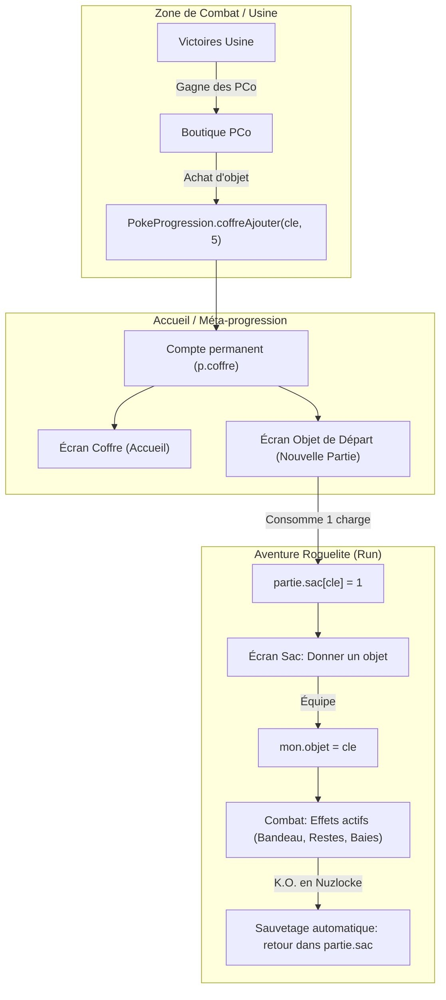

# Design Spec: Coffre d'Accueil, Objets de Départ à 5 Charges & Équipement dans le Sac

- **Date** : 2026-09-10
- **Auteur** : Antigravity & Elfamozoo
- **Statut** : Validé par le concepteur
- **Branche cible** : `feat/coffre-objets-depart` (ou `master`)

---

## 1. Contexte & Objectifs

### Problématique
Dans *Pokémon : La Voie des Maîtres*, les Points de Combat (PCo) gagnés à l'Usine de Combat permettent d'acheter des objets dans la Boutique PCo. Cependant :
1. Les achats étaient jusqu'à présent directement versés dans la partie en cours (`partie.sac`), créant une incohérence lorsque le joueur n'avait pas de run active ou démarrait une nouvelle aventure.
2. Il n'existait aucun moyen de conserver des objets au niveau méta-progression entre deux runs roguelite.
3. Dans le Sac d'aventure (`ecranSac`), il était possible de *reprendre* un objet tenu par un Pokémon, mais impossible de lui *donner* un objet tenu depuis le sac.
4. En mode Nuzlocke, la perte définitive d'un Pokémon détruisait également l'objet qu'il portait.

### Solution
Mettre en place une boucle méta-progression complète :
- **Un Coffre d'Accueil (Réserve PCo)** stockant les objets achetés avec un système de **5 utilisations (charges)** par objet.
- **Un Écran de Sélection au Départ d'une Aventure** permettant d'emporter 1 objet débloqué (consommant 1 charge).
- **Une interface d'Équipement (« Donner à un Pokémon »)** dans le Sac d'aventure.
- **Une règle de Sauvetage en Nuzlocke** qui restitue automatiquement l'objet tenu au sac lorsqu'un Pokémon tombe K.O.

---

## 2. Architecture & Composants



---

## 3. Modèle de Données & Persistance (`js/poke/progression.js`)

### Structure du Coffre
Le dictionnaire `coffre` est ajouté à l'objet racine de progression (`CLE = "poke_progression"`) :

```js
p.coffre = {
  "CHOICE_BAND": 5, // Clé de l'objet -> Nombre de charges restantes
  "LEFTOVERS": 10,  // Cumulable (+5 par achat)
  "LUM_BERRY": 3
};
```

### Méthodes d'API sur `PokeProgression`
1. `coffreLire()` :
   - Retourne `(lire().coffre) || {}`.
2. `coffreAjouter(cleObjet, charges)` :
   - Nombre de charges par défaut : 5.
   - Si la clé existe déjà : `p.coffre[cleObjet] += charges`.
   - Si nouvelle clé : `p.coffre[cleObjet] = charges`.
   - Persiste via `ecrire(p)` et retourne le solde de charges.
3. `coffreConsommer(cleObjet)` :
   - Si `!(p.coffre[cleObjet] > 0)`, retourne `0`.
   - Décrémente : `p.coffre[cleObjet] -= 1`.
   - Si `p.coffre[cleObjet] <= 0`, supprime l'entrée : `delete p.coffre[cleObjet]`.
   - Persiste via `ecrire(p)`.
   - Retourne le nombre de charges restantes (`0` si épuisé).
4. `coffreCompte()` :
   - Retourne le nombre d'objets distincts dans le coffre (`Object.keys(p.coffre || {}).length`).

---

## 4. Boutique PCo (`js/poke/ui-usine.js`)

### Découplage de la partie active
- Dans `ouvrirBoutiquePCo` :
  - L'action d'achat appelle `P.depenserPCo(item.prix)`.
  - En cas de succès, elle appelle exclusivement :
    ```js
    P.coffreAjouter(itemTrouve.cle, 5);
    ```
  - **Ne modifie plus** `partie.sac`.
- **Affichage sur chaque carte d'article** :
  - Si l'objet est déjà dans le coffre (`charges > 0`) : affiche un badge `En réserve : X utilisations`.
  - Son d'achat `ACHAT`, puis rafraîchissement immédiat de la boutique.

---

## 5. Écran du Coffre à l'Accueil (`js/poke/ui.js`)

### Bouton sur l'accueil
- Dans `accueil()`, à côté des boutons `#pk-dex-accueil`, `#pk-carnet`, `#pk-usine` :
  - Ajout du bouton `#pk-coffre` (« Coffre »).
  - Pastille dynamique si `P.coffreCompte() > 0` : `Coffre (N)`.
  - Clic : joue le son `PRESS_AB` et appelle `ecranCoffre()`.

### Interface `ecranCoffre()`
- Titre : **Coffre d'objets (Réserve PCo)**.
- Description claire expliquant le fonctionnement (5 charges par objet, 1 emporté par départ de run).
- Grille des objets avec :
  - Nom en français.
  - Catégorie (*Combat*, *Renfort*, *Baies*, *Vitamines*, *Pierres*).
  - Description officielle de l'effet.
  - Compteur doré : **`⚡ X utilisation(s) restante(s)`**.
- Si le coffre est vide : message invitant à explorer la Zone de Combat pour remporter des PCo.
- Bouton **« Retour à l'accueil »**.

---

## 6. Choix de l'Objet de Départ (`js/poke/ui.js`)

### Déclenchement
- Dans le flux d'onboarding d'une nouvelle aventure, à la validation de `ecranNoms()` :
  - Si `partie.compare` (Défi du Jour) : **ignoré**, passage direct à `carte()`.
  - Si le coffre est vide (`P.coffreCompte() === 0`) : passage direct à `carte()`.
  - Si le coffre contient au moins 1 objet : ouverture de `ecranObjetDepart()`.

### Interface `ecranObjetDepart()`
- Titre : **Équipement de départ**.
- Sous-titre : *Choisissez 1 objet de votre coffre à emporter dans votre sac d'aventure (1 charge sera consommée).*
- Grille d'objets sélectionnables (avec surbrillance au clic).
- Deux boutons en pied de page :
  1. **« Emporter [Nom de l'objet] »** (activé uniquement si un objet est sélectionné) :
     - Décrémente le coffre : `P.coffreConsommer(selection)`.
     - Crédite le sac de la nouvelle aventure : `partie.sac[selection] = (partie.sac[selection] || 0) + 1`.
     - Persiste la sauvegarde : `garderLeVoyage()`.
     - Joue le son `GET_ITEM_1`.
     - Démarre sur la carte : `carte()`.
  2. **« Partir sans objet »** :
     - Ne consomme aucune charge.
     - Démarre directement sur la carte : `carte()`.

---

## 7. Équipement dans le Sac d'Aventure (`js/poke/ui.js`)

### Nouvelle catégorie dans `RANGS_SAC`
```js
{
  cle: "tenus",
  test: function (o) { return estObjetTenuOuCombat(o); }
}
```
Regroupe :
- Tous les objets tenus compétitifs (`CHOICE_BAND`, `LEFTOVERS`, `SHELL_BELL`, `FOCUS_BAND`, `BRIGHTPOWDER`, `KINGS_ROCK`, `WHITE_HERB`, `MENTAL_HERB`).
- Les 17 renforts de type (+10% dégâts).
- Les baies de combat (`SITRUS_BERRY`, `LUM_BERRY`, `CHESTO_BERRY`, `LIECHI_BERRY`, `GANLON_BERRY`, `SALAC_BERRY`, `PETAYA_BERRY`, `APICOT_BERRY`).

### Interaction au clic : `choisirPorteur(cleObjet)`
1. Affiche les Pokémon de l'équipe (1 à 6).
2. Indique pour chacun son statut actuel :
   - *« Ne tient aucun objet »*
   - *« Tient déjà : [Nom de l'ancien objet] (reviendra dans le sac) »*
3. Au clic sur un Pokémon (`mon = partie.equipe[index]`) :
   - Si `mon.objet` existait : `partie.sac[mon.objet] = (partie.sac[mon.objet] || 0) + 1`.
   - `mon.objet = cleObjet`.
   - `partie.sac[cleObjet] -= 1` (si <= 0, supprimé du sac).
   - Sauvegarde : `W.PokeProgression.fusionner(partie)`.
   - Son `GET_ITEM_1`, message de confirmation, rafraîchissement du sac.

### Retrait de l'objet
- La section existante « En main » permet de reprendre un objet tenu à tout moment via `[data-reprendre]`. L'objet retiré repasse dans la section « Objets Tenus & Combat » du sac.

---

## 8. Sauvetage en Mode Nuzlocke (`js/poke/partie.js`)

Dans `nettoyerEquipe(p)` :
Lorsqu'un Pokémon tombe à <= 0 PV en règle Nuzlocke :
```js
if (p.equipe[i].pv <= 0) {
  partis.push(p.equipe[i]);
  // Récupération automatique de l'objet tenu avant le transfert dans perdus
  if (p.equipe[i].objet) {
    p.sac[p.equipe[i].objet] = (p.sac[p.equipe[i].objet] || 0) + 1;
    p.equipe[i].objet = null;
  }
  p.perdus.push({ n: p.equipe[i].n, niveau: p.equipe[i].niveau, zone: p.etape });
  p.equipe.splice(i, 1);
}
```
L'objet tenu n'est ainsi jamais détruit lors de la mort d'un Pokémon et redevient disponible dans le sac pour l'équipe restante.

---

## 9. Plan de Test & Vérification

### Tests automatisés (`tests/test_coffre_objets_depart.mjs`)
1. **API Coffre** :
   - `coffreAjouter` initialise et incrémente les charges (5, 10...).
   - `coffreConsommer` décrémente correctement.
   - Disparition de la clé à 0 charge.
2. **Découplage Boutique** :
   - L'achat à la Boutique PCo crédite le coffre et ne touche pas au sac de voyage.
3. **Attribution de départ** :
   - Sélection d'un objet au départ -> 1 charge en moins dans le coffre, 1 objet dans `partie.sac`.
   - Défi du jour -> aucun objet de départ n'est proposé ni injecté.
4. **Équipement Sac** :
   - Confier un objet met à jour `mon.objet`.
   - Remplacer un objet retourne le précédent dans `partie.sac`.
5. **Sauvetage Nuzlocke** :
   - Mort d'un Pokémon porteur en Nuzlocke -> son objet tenu est récupéré dans `p.sac`.
6. **Non-régression Globale** :
   - `tests/run_all_tests.mjs` (50 / 50 tests au vert).
   - Invariance des replays de combat et du PRNG Mulberry32.
